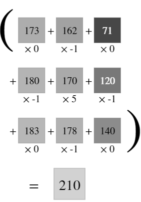
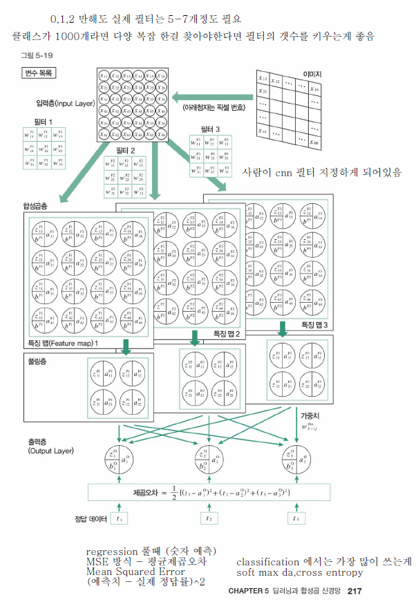

# 4.14 Wed Summary : CNN, CL  
### CNN - Convolution Neural Network (CL + Pooling(=Subsampling))
### CL - Convolution Layer 

## 1. CNN
    1) Called as '합성곱'
   
    2) Kernel = Filter = weight 값
   
    3) 
        i) Padding: Use for __Input image size = Output image size__

        ii) Zero Padding: Put 0 into padding
    
    4) Pooling: Mainly use MAX POOLING

## 2. CL 
   
   <계산법>
   
    

   

### Quiz 1 
__1. CL calculate__  
      

__2. Vector calculate__  
   (con for equal vector = equal to direction + scalar)
  
    i) Dot Product (내적)  
      

    ii) Scalar Product (크기)  
     

__3. Gradient Descent (경사하강법)__  

    i) Initial Weight 값은 랜덤한 값으로 초기화 시킨다 

    ii) Loss 를 Weight 에 대해 편미분 해서 기울기가 0이 되는 지점(극소점)까지 반복  

    iii) 주어진 Loss 함수를 Loss 를 감소시키는 방향으로 미분해서 아주 조금씩 이동하는 방법  

    iv) W old 값에서 - eta * del W * L 만큼을 이동해서 새로운 곳(W new) 으로 이동한다  

    v) 이러한 작업들을 여러번에 나눠서 작업할 수 있으나, 
    Learning rate 이 너무 작거나 크면 시간이 너무 많이 걸리거나 최소가 되는 위치를 찾기가 힘들다 
    (극소점을 지나쳐버리니까)

   
 
   

__4. Cost Function (= Loss Function). MSE 로 LOSS 값 구하는 문제__ 

   

        

t = 실제 값  
y = 예측 값

   

__5. Explain CNN__  

    <계산법>

    1. [입력층] 원본 이미지의 입력 값 = 6 * 6 * 1 (3 for color, 1 for gray). depth = 1 

    2. [필터 및 합성곱층] 원본이미지 convolution 작업 : 필터를 3개 적용하기로 함 (본 이미지에서는)

    2-1. [합성곱층 중 필터의 차원] 필터의 차원 = 3 * 3 * 1 (여기서 1은 이미지가 1개라서 필터도 1개)

    2-2. [합성곱층의 결과] 4 * 4 인 이유: W out 공식 

    3. [풀링(Pooling)층] 2 * 2 로 줄었다 = 사이즈를 줄이는게 목적이기 때문. 보통 MAX Pooling 씀

    4. [출력층] 제곱오차를 이용하여 Loss 값을 구하는데 MSE 를 사용함. 
    
   

   
   
    

